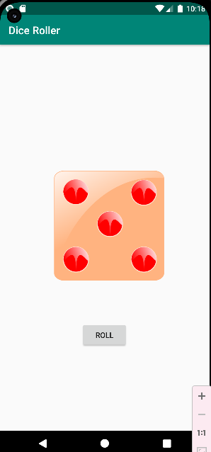
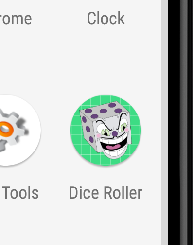

# Aplicación para tirar un dado

En cada rama de este repositorio están los pasos a seguir para completar esta aplicación.

Consiste en pulsar un botón para lanzar un dado, cada vez que lo pulsas aparecen las diferentes caras del dado.

 
