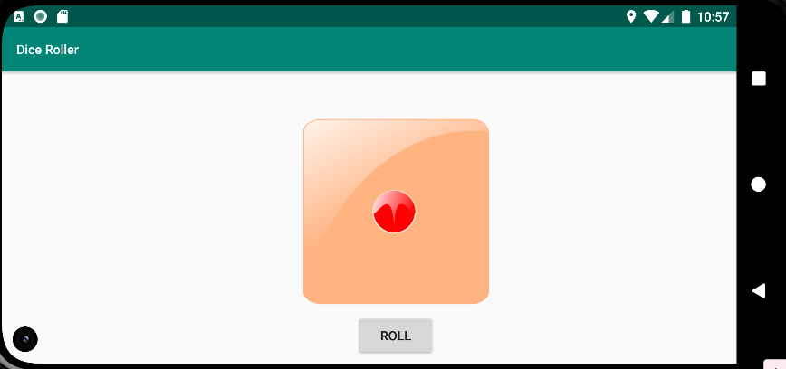
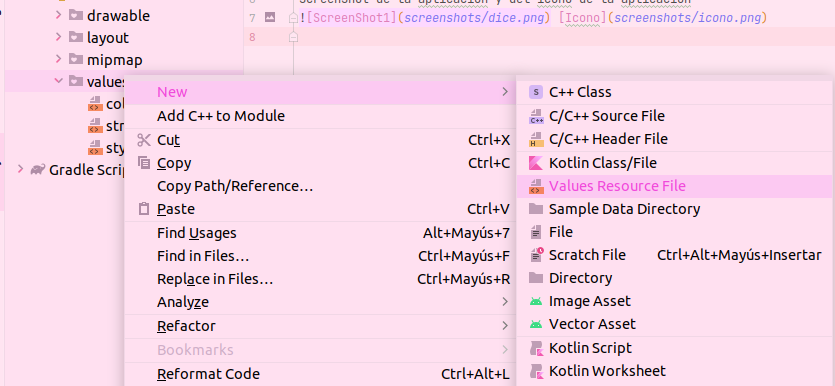

# Aplicación para tirar un dado

En cada rama de este repositorio están los pasos a seguir para completar esta aplicación.

Consiste en pulsar un botón para lanzar un dado, cada vez que lo pulsas aparecen las diferentes caras del dado.


La aplicación también tiene modo landscape

 


### Ejercicios del tutorial :

-  Ejercicio1:
   
   [Añadimos un botón](https://github.com/GorillaGrip/DiceRoll/commit/0b796bca731945077c36c4f178bb53cfa51c85d6)  
  
- Ejercicio 2 :
  [Cambiamos el id del botón , se le asigna a una variable a través de findViewById y  añadimos una Toast  ](https://github.com/GorillaGrip/DiceRoll/commit/2daeacb76460bcaf9638e78ff6cf98720ff7436a)
- Ejercicio 3 :
  [Creamos una función que genere un número aleatorio y aparezca en el TextView](https://github.com/GorillaGrip/DiceRoll/commit/872d397341ed187531079e9face50138714e50e0)
- Ejercicio 4 :
  [Se añaden imágenes del dado al drawable y se modifica la función diceRoll para llamar a las imagenes](https://github.com/GorillaGrip/DiceRoll/commit/872d397341ed187531079e9face50138714e50e0)
- Ejercicio 5 :
  [Se extrae la variable ImageView con un lateInit ](https://github.com/GorillaGrip/DiceRoll/commit/f8c556cf3588da358e61052c4e74fc2a787eb930)


### Strings con diferentes idiomas

Para compatibilizar una app con diferentes idiomas se utilizan los recursos de string,  en los cuales  almacenamos el contenido en un archivo xml en lugar de cargar el texto directamente desde el código
Creamos en values  un nuevo fichero con el nombre strings dónde  cambiaremos el nombre de la app y el texto según idiomas.




Estos strings se llaman en  el layout para para que los elementos de la aplicación cambien de idiomas.
Ejemplo :

```
<Button  
android:id="@+id/roll_button"  
style="@style/Widget.MaterialComponents.Button.TextButton"  
android:layout_width="wrap_content"  
android:layout_height="wrap_content"  
android:layout_gravity="center_horizontal"  
 android:text="@string/roll"
app:icon="@drawable/dice_king"  
app:layout_constraintEnd_toEndOf="parent"  
app:layout_constraintStart_toStartOf="parent" />
```

### Cambiando la función random
Cambiamos la función ramdon por otra parecida que hace lo mismo,  se le da un rango en el que puede variar el valor obtenido.
~~~
val randomInt = (1..6).random()
~~~
[Commit](https://github.com/GorillaGrip/DiceRoll/commit/872d397341ed187531079e9face50138714e50e0)

### Modificar el botón para usar material.io y que tenga asociado un icono

Para poder usar material.io y darle un estilo diferente al botón primero debemos implementar la librería en el build.gradle (Module) :    `'com.google.android.material:material:1.4.0'`
y así poder acceder a sus recursos.
Luego definimos el estilo en styles y lo  el estilo al elemento que deseemos modificar, en este caso el botón.
Aplicaremos  `style="@style/Widget.MaterialComponents.Button.TextButton`
para que el fondo del botón sea transparente.
Para añadir un icono simplemente debes descargarlo y añadirlo a drawable, una vez añadido mediante la propiedad app:icon del botón lo llamas

